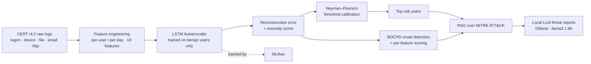

# LABAD — LSTM-Autoencoder Behavioral Anomaly Detection

**Insider-threat detection that doesn't just flag *who* is suspicious — it pinpoints *when* the compromise began**, by treating each user's behavior as a dynamical system and detecting the moment its regime changes.

Built on the CERT r4.2 insider-threat dataset. Unsupervised anomaly detection → statistically-calibrated alerting → **behavioral bifurcation (onset) detection** → RAG-grounded LLM threat reports, wrapped in Docker + MLflow.

---

## Why this is different

Almost every UEBA project answers *"is this user anomalous?"* and stops at an AUC number. LABAD adds the question a SOC analyst actually asks: **"this account looks compromised — when did it start, so I know how much damage to assume?"**

It answers that with **Bayesian Online Changepoint Detection (BOCPD)** on each user's anomaly-score time series. The framing is from nonlinear dynamics: an insider going rogue is a **bifurcation** — a sharp qualitative shift from one behavioral regime to another — and BOCPD detects exactly that, online, one day at a time.

---

## Architecture



---

## The pipeline

| Stage | What it does | Key file(s) |
|---|---|---|
| **1. Feature engineering** | Raw CERT logs (~16 GB) → per-user/day vectors of 18 behavioral features (after-hours activity, USB usage, file access, external email, job-site browsing…) | `models/dataset.py` |
| **2. Anomaly model** | LSTM autoencoder learns the *manifold of normal* from benign users only; reconstruction error becomes the anomaly score. Unsupervised — generalizes to novel attacks | `models/encoder.py`, `train.py` |
| **3. Calibrated decisioning** | Neyman–Pearson threshold fixes the false-positive rate to the SOC's analyst budget and maximizes detection under that constraint | `eval/anomaly_scorer.py`, `eval/run_week2.py` |
| **4. Onset localization** | BOCPD finds *when* behavior changed regime; per-feature scoring reveals *which* behavior drove it | `models/bocpd.py`, `eval/run_bocpd.py`, `eval/run_perfeature.py` |
| **5. LLM threat reports** | RAG over the MITRE ATT&CK knowledge base + a local LLM writes analyst-ready reports — fully air-gapped, no data leaves the host | `llm/`, `eval/run_week3.py` |

---

## Results

**Detection (user-level, CERT r4.2 — 70 malicious / 256 test users):**

| Metric | Value |
|---|---|
| AUC-ROC | **0.87** |
| Average Precision | **0.72** |
| Malicious vs benign score separation | **7.36×** |
| TPR @ 10% FPR | **55.7%** |
| At 1%-FPR NP operating point | Precision **70%**, Recall **43%** |
| **Precision@10** (top-3 aggregation) | **100%** (10/10) |

**Onset detection (BOCPD):** strongly scenario-dependent, exactly as the bifurcation framing predicts —

| CERT scenario | Onset localized within ±7 days | Behavior |
|---|---|---|
| **Scenario 1** (after-hours + removable media + exfil) | **~80% (24–25/30)**, median 3 d, often 1–2 d **early** | *Sharp* regime shift |
| Scenario 2 (job-site surfing → exfil) | low | *Gradual* drift |
| Scenario 3 (disgruntled sysadmin) | ~40% | Mixed |

BOCPD detects **sharp** behavioral bifurcations very well and **gradual** drift poorly — which is correct physics: a bifurcation is a sharp qualitative transition, so a slow ramp produces no run-length collapse.

---

## Honest findings (the part interviewers respect)

This project is documented with the negative results, because diagnosing *why* something doesn't work is the harder skill:

- **The `R[0,t]` changepoint readout is a no-op.** A naive BOCPD implementation reads off changepoints as `R[0,t]`, but algebra shows `R[0,t] ≡ hazard` at every step — it carries zero information. The real signal is the run-length posterior *collapsing onto short run lengths*; LABAD detects that instead. See `models/bocpd.py`.
- **CUSUM and Critical Slowing Down don't beat BOCPD here — and we root-caused why.** Under honest causal evaluation both false-alarm immediately. Cause: overlapping 30-day windows make the score series heavily autocorrelated (lag-1 ≈ 0.83–0.99), violating their independence assumptions. (`models/cusum.py`, `models/early_warning.py`, `eval/run_ensemble.py`.)
- **The real bottleneck was the *signal*, not the detector.** The scalar reconstruction error averages over all 18 features, so a gradual insider's onset is a **1.03× non-event** in the scalar — yet **151× in a single feature** (`exe_access_count`). Per-feature scoring (`eval/run_perfeature.py`) recovers that signal and adds feature-level explainability, while matching the scalar on sharp insiders. *You can't detect what the score doesn't encode.*
- **Gradual insiders aren't just hard — they're unlocalizable at the CERT label.** Pushing scenario-2 further showed the discriminating raw behaviors are *more* active **before** the labeled onset than after (`job_site_visits`: 22.5% of pre-onset days vs 14.3% after). The label marks the final exfiltration act, not a behavioral discontinuity — so there is no bifurcation there to detect. A negative result root-caused to the *data*, not the method.
- **Critical slowing down *does* work — as early warning, not detection.** Anomaly scores show rising variance + autocorrelation **before** abrupt onsets: warnings are **2.28× enriched** in the 45 days pre-onset (24/30 users, binomial *p* = 7×10⁻⁴, Wilcoxon *p* = 2×10⁻⁴), robust across parameters (`eval/run_early_warning.py`). A statistically significant predictive signature — the dynamical-systems framing made falsifiable and confirmed.

---

## Quickstart

### Local

```bash
python -m venv .venv && source .venv/bin/activate
pip install -r requirements.txt

python train.py --epochs 50          # 1. train autoencoder (MLflow-tracked)
python eval/run_week2.py             # 2. anomaly scoring + NP calibration
python eval/run_bocpd.py             # 3. BOCPD onset detection
python eval/run_perfeature.py        # 3b. per-feature ablation
python eval/run_early_warning.py     # 3c. critical-slowing-down early warning
python eval/run_week3.py             # 4. LLM threat reports (needs Ollama)
```

### Docker

```bash
docker compose up        # ollama + labad services; runs the report pipeline
```

The `labad` image is **CPU-only (2.93 GB)** — the default PyTorch wheel's CUDA stack is stripped via the PyTorch CPU index. `data/` and `checkpoints/` are bind-mounted; Ollama is reached at the compose service name via `OLLAMA_URL`.

### Experiment tracking

```bash
mlflow ui --backend-store-uri sqlite:///mlflow.db     # → localhost:5000
```

---

## Repository structure

```
LABAD/
├── models/
│   ├── dataset.py        # CERT feature engineering + windowed dataset
│   ├── encoder.py        # LSTM autoencoder (+ per-feature scoring)
│   ├── bocpd.py          # Bayesian Online Changepoint Detection
│   ├── cusum.py          # CUSUM (gradual-drift complement)
│   └── early_warning.py  # Critical Slowing Down (early-warning signals)
├── eval/
│   ├── anomaly_scorer.py # scoring, NP calibration, metrics, plots
│   ├── run_week2.py      # detection + calibration
│   ├── run_bocpd.py      # onset detection
│   ├── run_perfeature.py # per-feature ablation
│   ├── run_early_warning.py # critical-slowing-down early warning
│   ├── run_ensemble.py   # BOCPD + CUSUM + CSD comparison
│   └── run_week3.py      # RAG + LLM threat reports
├── llm/                  # MITRE ATT&CK RAG + Ollama explainer
├── train.py              # training loop (MLflow-tracked)
├── LABAD_report.tex      # full technical report (LaTeX)
├── Dockerfile · docker-compose.yml · requirements.txt
```

---

## Future work

- **Sparse multivariate online changepoint** — recover gradual (Scenario 2) insiders, whose signal lives in 1–2 sparse features (the open problem `run_perfeature.py` surfaces).
- **Critical-slowing-down early warning** — predict onset *before* it happens via rising variance + autocorrelation, the canonical tipping-point signal, on a decorrelated signal.
- **Beyond human insiders** — the core capability ("detect when an entity's behavior changes regime on a stream of its actions") applies directly to **monitoring autonomous AI agents** for compromise, prompt-injection, or goal-drift.

---

## Stack

PyTorch · scikit-learn · FAISS · sentence-transformers · Ollama (llama3.1:8b) · MLflow · Docker · CERT r4.2

> The physics framing isn't decoration — BOCPD literally computes the run-length posterior whose collapse *is* the behavioral bifurcation. Nonlinear dynamics applied to security.
